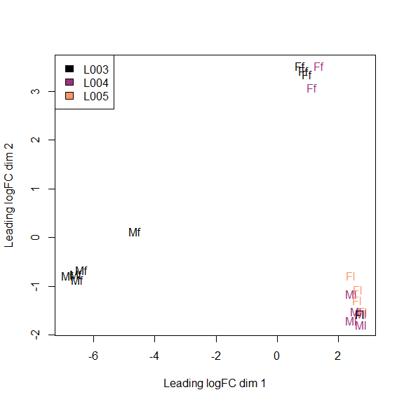
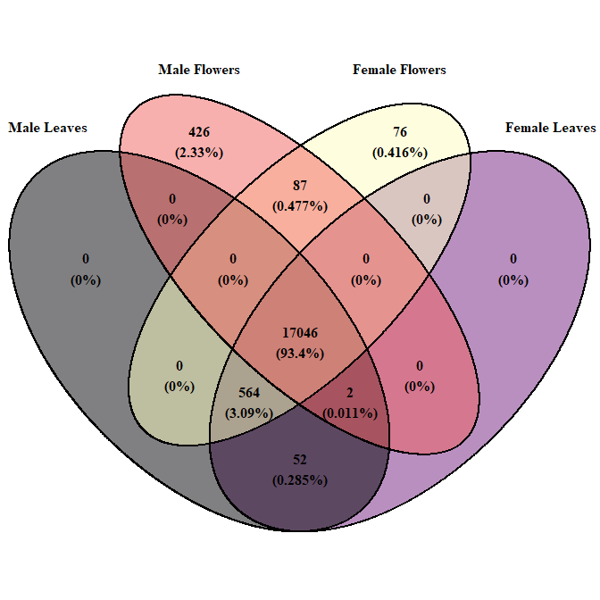
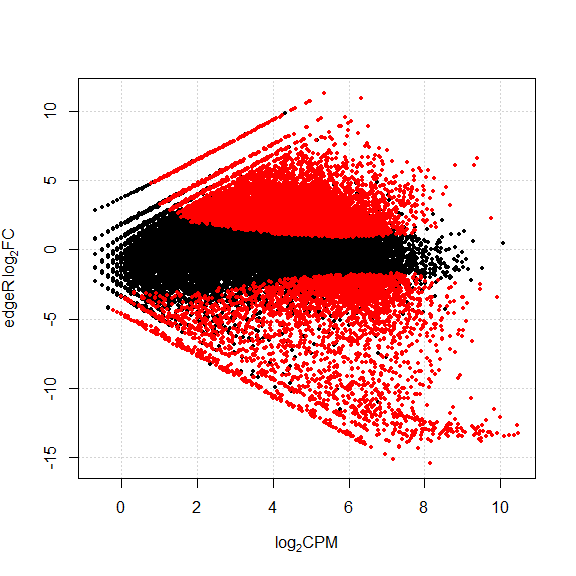
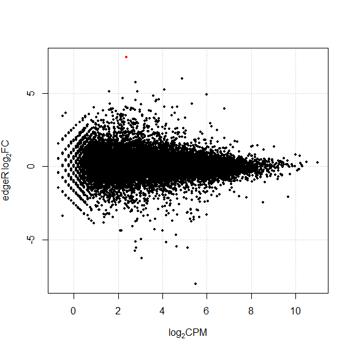
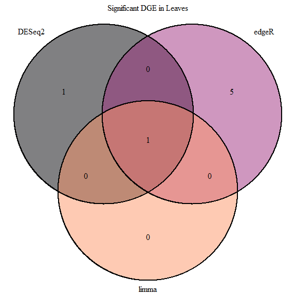
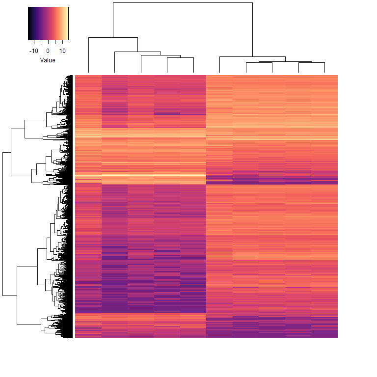

Analysis of patterns of sex-specific and sex-biased gene expression in
*Populus balsamifera*
================

The analysis described in this notebook is a part a published manuscript
in *New Phytologist*, found here <https://doi.org/10.1111/nph.15421>

**Note**: the analyses that we report in this manuscript were performed
with R version 3.3.0, and the Bioconductor packages for version 3.3.0.
We have found that different versions of the Bioconductor packages
identify different numbers of genes as differentially expressed
(although the patterns are qualitatively the same). In the interest of
reproducibility, the older release of Bioconductor packages DESeq2,
limma, and edgeR can be installed with the following code in
R:

``` r
install.packages("BiocInstaller",repos="http://bioconductor.org/packages/3.3/bioc")

library("BiocInstaller")

biocLite("DESeq2")
biocLite("edgeR")
biocLite("limma")
```

## Load required packages

``` r
library("DESeq2")
library("limma")
library("edgeR")
library("ggplot2")
library("VennDiagram")
library("viridis")
library("gplots")
```

## Report version numbers of packages used for analysis

``` r
sessionInfo()
```

    ## R version 3.3.0 (2016-05-03)
    ## Platform: x86_64-w64-mingw32/x64 (64-bit)
    ## Running under: Windows 10 x64 (build 17134)
    ## 
    ## locale:
    ## [1] LC_COLLATE=English_United States.1252 
    ## [2] LC_CTYPE=English_United States.1252   
    ## [3] LC_MONETARY=English_United States.1252
    ## [4] LC_NUMERIC=C                          
    ## [5] LC_TIME=English_United States.1252    
    ## 
    ## attached base packages:
    ##  [1] grid      parallel  stats4    stats     graphics  grDevices utils    
    ##  [8] datasets  methods   base     
    ## 
    ## other attached packages:
    ##  [1] gplots_3.0.1.1             viridis_0.5.1             
    ##  [3] viridisLite_0.3.0          VennDiagram_1.6.20        
    ##  [5] futile.logger_1.4.3        ggplot2_3.2.0             
    ##  [7] edgeR_3.14.0               limma_3.28.21             
    ##  [9] DESeq2_1.12.4              SummarizedExperiment_1.2.3
    ## [11] Biobase_2.32.0             GenomicRanges_1.24.3      
    ## [13] GenomeInfoDb_1.8.7         IRanges_2.6.1             
    ## [15] S4Vectors_0.10.3           BiocGenerics_0.18.0       
    ## [17] knitr_1.23                
    ## 
    ## loaded via a namespace (and not attached):
    ##  [1] bit64_0.9-7          splines_3.3.0        gtools_3.8.1        
    ##  [4] Formula_1.2-3        assertthat_0.2.1     latticeExtra_0.6-28 
    ##  [7] blob_1.2.0           yaml_2.2.0           pillar_1.4.2        
    ## [10] RSQLite_2.1.0        backports_1.1.4      lattice_0.20-33     
    ## [13] glue_1.3.1           digest_0.6.20        RColorBrewer_1.1-2  
    ## [16] XVector_0.12.1       checkmate_1.9.4      colorspace_1.4-1    
    ## [19] htmltools_0.3.6      Matrix_1.2-6         XML_3.98-1.11       
    ## [22] pkgconfig_2.0.2      genefilter_1.54.2    zlibbioc_1.18.0     
    ## [25] purrr_0.3.2          xtable_1.8-4         scales_1.0.0        
    ## [28] gdata_2.18.0         BiocParallel_1.6.6   htmlTable_1.13.1    
    ## [31] tibble_2.1.3         annotate_1.50.1      withr_2.1.2         
    ## [34] nnet_7.3-12          lazyeval_0.2.2       survival_2.44-1.1   
    ## [37] magrittr_1.5         crayon_1.3.4         memoise_1.1.0       
    ## [40] evaluate_0.14        foreign_0.8-66       tools_3.3.0         
    ## [43] data.table_1.12.2    formatR_1.7          stringr_1.4.0       
    ## [46] locfit_1.5-9.1       munsell_0.5.0        cluster_2.0.4       
    ## [49] lambda.r_1.2.3       AnnotationDbi_1.34.4 caTools_1.17.1.2    
    ## [52] rlang_0.4.0          RCurl_1.95-4.10      rstudioapi_0.10     
    ## [55] htmlwidgets_1.3      bitops_1.0-6         base64enc_0.1-3     
    ## [58] rmarkdown_1.14       gtable_0.3.0         DBI_1.0.0           
    ## [61] R6_2.4.0             gridExtra_2.3        dplyr_0.8.3         
    ## [64] bit_1.1-12           zeallot_0.1.0        Hmisc_4.2-0         
    ## [67] futile.options_1.0.1 KernSmooth_2.23-15   stringi_1.4.3       
    ## [70] Rcpp_1.0.1           vctrs_0.2.0          geneplotter_1.50.0  
    ## [73] rpart_4.1-10         acepack_1.4.1        tidyselect_0.2.5    
    ## [76] xfun_0.8

## Source some convenience functions used for the analysis

``` r
source("R/runDGE.R")
source("R/getSpecificGenes.R")
```

## Read in count data

Prior to analysis, raw reads were processed as follows: \* Adapter
sequences were trimmed from the reads, and the read sequences were
filtered for quality (Q=15) and minimum length (l=30) using fastq-mcf \*
Trimmed and filtered reads to the *Populus trichocarpa* reference genome
version 3 using the program hisat2 v. 2.0.4 with the parameters
–no-mixed, –no-discordant, –score-min L,0,-0.1, and –dta \* Gene
expression was quantified using the program htseq-count version 0.6.0

The read counts are were then concatenated, and are available in Table
S3, which is used for downstream
analyses

``` r
TableS3 <- read.table("data/TableS3.txt", skip=1, header=T, stringsAsFactors=F,row.names=1)

group <- c("Mf","Mf","Mf","Mf","Mf",                  
           "Ff","Ff","Ff","Ff","Ff",                   
           "Ml","Ml","Ml","Ml","Ml",        
           "Fl","Fl","Fl","Fl","Fl")

lane <- c("L003","L003","L003","L003","L003",
          "L003","L003","L003","L004","L004",
          "L004","L004","L004","L004","L004",          
          "L005","L004","L005","L005","L005")

allCounts <- DGEList(TableS3)
allCounts$samples$group <- group
allCounts$samples$lane <- lane
```

### Remove metatags from count data

Drop the metatags for the reads that either didn’t align to an annotated
gene, or did so poorly.

Note: these features are included in Table S3 and should be removed
before analysis.

``` r
allCounts <- allCounts[row.names(allCounts$counts)!= "__no_feature" &
                                     row.names(allCounts$counts)!= "__ambiguous" &
                                     row.names(allCounts$counts)!= "__too_low_aQual" & 
                                     row.names(allCounts$counts)!= "__not_aligned" & 
                                     row.names(allCounts$counts)!= "__alignment_not_unique",]
```

### Multidimensional scaling plot

Use an MDS plot to assess whether there are batch effects. We expect
samples to cluster by sex and tissue, rather than by sequencing lane.

``` r
mdsCol = magma(10)[c(1,5,8)]

plotMDS(allCounts, labels=group, col=c(rep(mdsCol[1], 8), rep(mdsCol[2], 7), mdsCol[3], rep(mdsCol[3], 3)))
legend("topleft", fill=magma(10)[c(1,5,8)], legend=unique(allCounts$samples$lane))
```



## Sex-specific gene expression

**getSpecificGenes()** is a simple function that quantifies genes that
are expressed and co-expressed in all combinations of sexes and tissues
from this experiment. It returns a data frame of all the relevant genes,
with variables that indicate whether a gene is expressed in each tissue
(Y/N).

``` r
specificGenes <- getSpecificGenes(allCounts, incLib=5, excLib=5, thresh=0.1, type="CPM")
```

For example, a gene expressed only in male flowers would have the
following
    values:

``` r
specificGenes[1,]
```

    ##                    gene maleFlowers femaleFlowers maleLeaves femaleLeaves
    ## 1 Potri.001G021900.v3.0           Y             N          N            N

``` r
specificGeneCategories <- list(maleLeaves = specificGenes$gene[specificGenes$maleLeaves == "Y"],
                              femaleLeaves = specificGenes$gene[specificGenes$femaleLeaves == "Y"],
                              maleFlowers = specificGenes$gene[specificGenes$maleFlowers == "Y"],
                              femaleFlowers = specificGenes$gene[specificGenes$femaleFlowers == "Y"])

# Disable generation of log files for venn.diagram
futile.logger::flog.threshold(futile.logger::ERROR, name = "VennDiagramLogger")
```

    ## NULL

``` r
sexSpecificVenn <- venn.diagram(specificGeneCategories, filename=NULL, 
                              #fill=c("#ABABFF", "#FFABAB", "#FFFFAB", "#ABFFAB" )
                              fill=magma(4), 
                              #main="Sex- and tissue-specific expression", 
                              print.mode=c("raw", "percent"),
                              category.names=c("Male Leaves", "Female Leaves", "Male Flowers", "Female Flowers"),
                              fontface="bold",
                              cat.fontface="bold")
grid.newpage()
grid.draw(sexSpecificVenn)
```



## Sex-biased gene expression

### Filter lowly expressed genes

To limit false positives resulting from lowly expressed genes, genes
with read counts below 0.1 counts per million (CPM) were removed prior
to downstream
analysis

``` r
flowerCountsRaw <- allCounts[,allCounts$samples$group=="Mf" | allCounts$samples$group=="Ff"]
flowerCountsRaw <- as.data.frame(flowerCountsRaw$counts)

flowerCounts <- flowerCountsRaw[rowSums(cpm(flowerCountsRaw)>0.1) >=5, ]

leafCountsRaw <- allCounts[,allCounts$samples$group=="Ml" | allCounts$samples$group=="Fl"]
leafCountsRaw <- as.data.frame(leafCountsRaw$counts)

leafCounts <- leafCountsRaw[rowSums(cpm(leafCountsRaw)>0.1) >=5, ]
```

### Run DGE function for flower and leaf counts separately

**runDGE()** is a function that takes a table of count data, the number
of individuals in each comparision group, a significance threshold, and
then estimates differential gene expression using **DESeq2**, **limma**,
and **edgeR**. If *fullResults*=TRUE, the function returns the FDR and
log<sub>2</sub>FC values for all genes. If *fullResults*=FALSE, then the
function just returns the FDR and log<sub>2</sub>FC for genes that are
below the FDR threshold across all analyses.

The function also generates and MA plot to show the relationship between
CPM and log<sub>2</sub>FC for all genes. The red dots are significantly
differentially expressed with an FDR value below the threshold for all
three
analyses.

``` r
flowerAnalysis <- runDGE(flowerCounts,group1=5,group2=5,FDRthresh=0.01,fullResults=TRUE)
```



    ## You have 11068 genes differentially expressed across all analyses 
    ## You have 10750 genes differentially expressed across all analyses, with a 2-fold change

``` r
leafAnalysis <- runDGE(leafCounts,group1=5,group2=5,FDRthresh=0.01,fullResults=TRUE)
```



    ## You have 1 genes differentially expressed across all analyses 
    ## You have 1 genes differentially expressed across all analyses, with a 2-fold change

### Examine overlap in the significance estimates between DESeq2, edgeR, and limma

``` r
sigFlowerResults <- list(DESeq2 = flowerAnalysis$gene[flowerAnalysis$DESeq2_FDR < 0.01 & !is.na(flowerAnalysis$DESeq2_FDR)],
                         edgeR = flowerAnalysis$gene[flowerAnalysis$edgeR_FDR < 0.01 & !is.na(flowerAnalysis$edgeR_FDR)],
                         limma = flowerAnalysis$gene[flowerAnalysis$limma_FDR < 0.01 & !is.na(flowerAnalysis$limma_FDR)])
sigFlowerVenn <- venn.diagram(sigFlowerResults, filename=NULL, fill=magma(10)[c(1,5,8)], main="Significant DGE in Flowers", height = 3000, width = 3000)
grid.newpage()
grid.draw(sigFlowerVenn)
```


``` r
sigLeafResults <- list(DESeq2 = leafAnalysis$gene[leafAnalysis$DESeq2_FDR < 0.01 & !is.na(leafAnalysis$DESeq2_FDR)],
                         edgeR = leafAnalysis$gene[leafAnalysis$edgeR_FDR < 0.01 & !is.na(leafAnalysis$edgeR_FDR)],
                         limma = leafAnalysis$gene[leafAnalysis$limma_FDR < 0.01 & !is.na(leafAnalysis$limma_FDR)])
sigLeafVenn <- venn.diagram(sigLeafResults, filename=NULL, fill=magma(10)[c(1,5,8)],main="Significant DGE in Leaves",height = 3000, width = 3000)
grid.newpage()
grid.draw(sigLeafVenn)
```



### Plot heatmap of DGE in flowers

``` r
sigFlowerGenes <- flowerAnalysis$gene[flowerAnalysis$DESeq2_FDR < 0.01 & !is.na(flowerAnalysis$DESeq2_FDR) &
                                      flowerAnalysis$edgeR_FDR < 0.01 & !is.na(flowerAnalysis$edgeR_FDR) &
                                      flowerAnalysis$limma_FDR < 0.01 & !is.na(flowerAnalysis$limma_FDR)]

subAll <- allCounts[,allCounts$samples$group=="Mf" | allCounts$samples$group=="Ff"]

subAll <- subAll[row.names(subAll$counts) %in% sigFlowerGenes, ]

plotMap <- data.frame(subAll$counts)
plotMap$M1 <- cpm(plotMap[,1], log=T)
plotMap$M2 <- cpm(plotMap[,2], log=T)
plotMap$M3 <- cpm(plotMap[,3], log=T)
plotMap$M4 <- cpm(plotMap[,4], log=T)
plotMap$M5 <- cpm(plotMap[,5], log=T)
plotMap$F1 <- cpm(plotMap[,6], log=T)
plotMap$F2 <- cpm(plotMap[,7], log=T)
plotMap$F3 <- cpm(plotMap[,8], log=T)
plotMap$F4 <- cpm(plotMap[,9], log=T)
plotMap$F5 <- cpm(plotMap[,10], log=T)

plotMat <- as.matrix(cbind(plotMap[,c(11:20)]))

heatmap.2(plotMat, col=magma(256), density.info="none", trace="none", 
          labCol=NA, labRow=NA, key.title=NA, keysize = 1)
```


